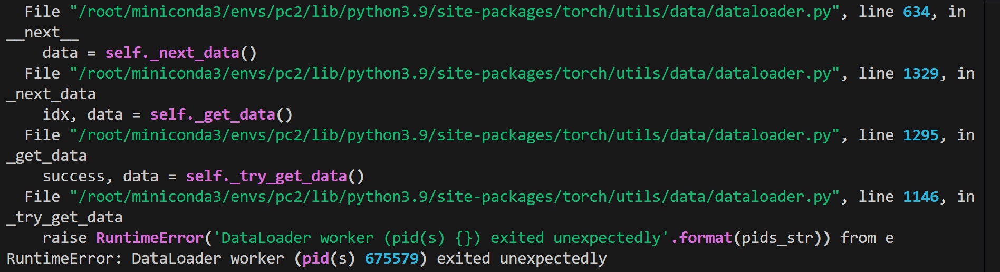
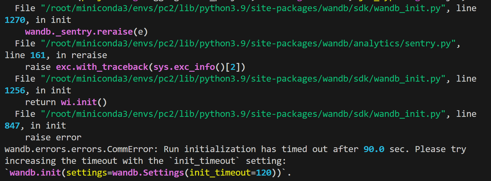

### Dependencies

```shell
# Create a conda environment
conda create -n pc2 python==3.9
conda activate pc2

# Find the appropriate version of torch on https://pytorch.org/get-started/previous-versions/
conda install pytorch==2.0.0 torchvision==0.15.0 torchaudio==2.0.0 pytorch-cuda=11.7 -c pytorch -c nvidia
```

Now we need to install **PyTorch3D**. There are potential issues with online installation, hence we opt for offline installation.

Download the appropriate version of the package on https://anaconda.org/pytorch3d/pytorch3d/files. We have chosen `pytorch3d-0.7.3-py39_cu117_pyt200.tar.bz2`.

According to the Readme file, we need to unzip and modify line 634 of `pytorch3d/implicitron/dataset/frame_data.py` to

```python
image_rgb = torch.from_numpy(load_image(self._local_path(path)))
```

Then continue with the installation of dependencies.

```shell
# Re-compress the modified package
tar -jcvf pytorch3d-0.7.3-py39_cu117_pyt200.tar.bz2 pytorch3d

# Install offline
conda install pytorch3d-0.7.3-py39_cu117_pyt200.tar.bz2

# Install other dependencies
pip install -r requirements.txt
```


### Data

For our data, we use [Co3Dv2](https://github.com/facebookresearch/co3d) and just download one category or a subset of the categories.

Then set the environment variable `CO3DV2_DATASET_ROOT` to the dataset root:

```
export CO3DV2_DATASET_ROOT="your_dataset_root_folder"
```




**最可能的原因是：**cuda 虚拟环境的共享内存不足，解决办法是改成更小的batchsize



新增`settings=wandb.Settings(init_timeout=120)`

```
wandb.init(project=cfg.logging.wandb_project, name=cfg.run.name, job_type=cfg.run.job, 
                   config=OmegaConf.to_container(cfg), settings=wandb.Settings(init_timeout=120))
```


